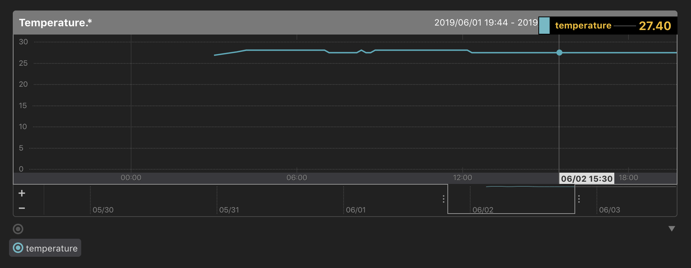
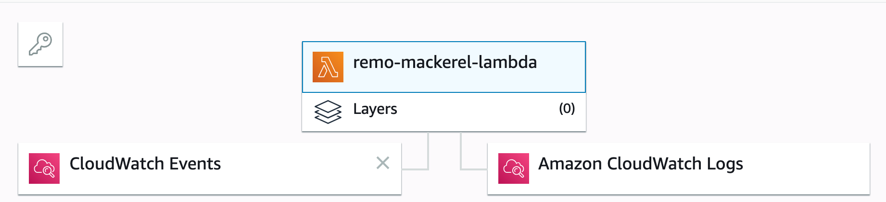

# remo to mackerel
This code get my room temperature from [Nature](https://nature.global/), and post it as service metrics to [Mackerel](https://mackerel.io/ja/) by AWS Lambda.



## Usage
set Nature Remo api token, Mackerel api key to environment variable.

```
$ export REMOTOKEN=xxxxxxxxxxxxxxxxxxxxxxxxxxxxxxxxxxxxxxxxxxxxxxxxxxxxxxxxxx
$ export MACKERELKEY=xxxxxxxxxxxxxxxxxxxxxxxxxxxxxxxxxxxxxxxxxxxxxxxxxxxxxxxxxx
$ pip install requests
$ python lambda_function.py
```

### work on AWS Lambda



```
$ mkdir packages
$ cd packages/
$ pip install requests -t .
$ zip -r9 ../function.zip .
$ zip -g function.zip lambda_function.py
```

and upload function.zip to AWS Lambda.
